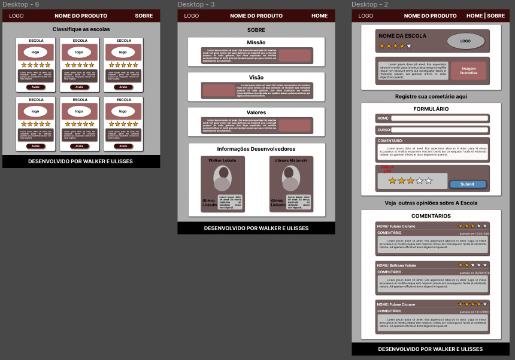
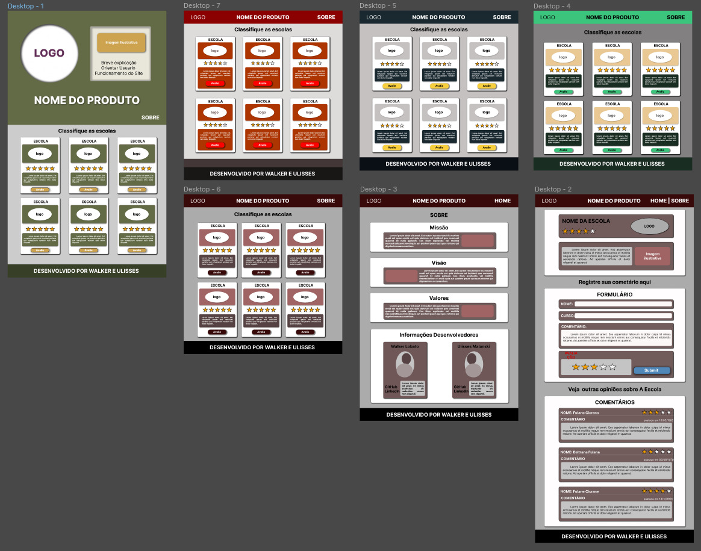
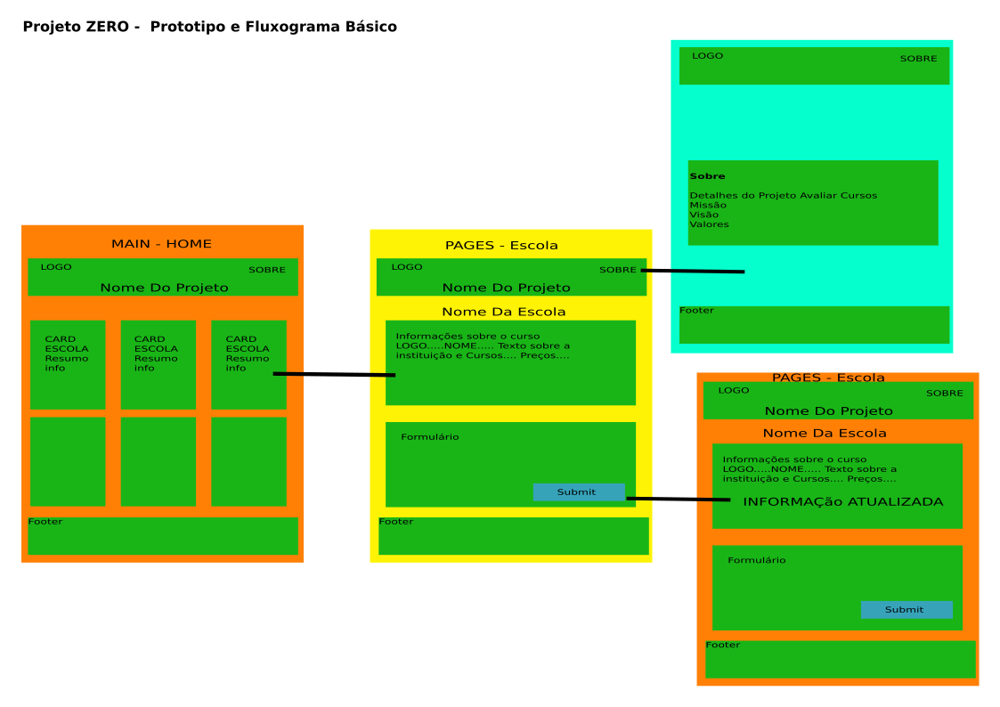

# Course Rank - Online school rate App

## Objectives
  
This application intent is to be a place for techology students to rate their online schools.
  
## Tech Objectives
- Do a fluxogram and a prototype using Miro and Figma
- 
- To develop a CRUD aplication in order to let the user:
  - create a comment
  - read his comments and other people comments
  - update (edit) his previous comment
  - delete his comment  
  
- To create a responsive and intuitive interface

## Technologies in this project
- HTML5
- CSS3
- SASS
- JavaScript
- TypeScript
- REST API
- ReactJs
- NextJs
- FontAwesome
- Material UI
  

### Prototypes

### Fluxogram

